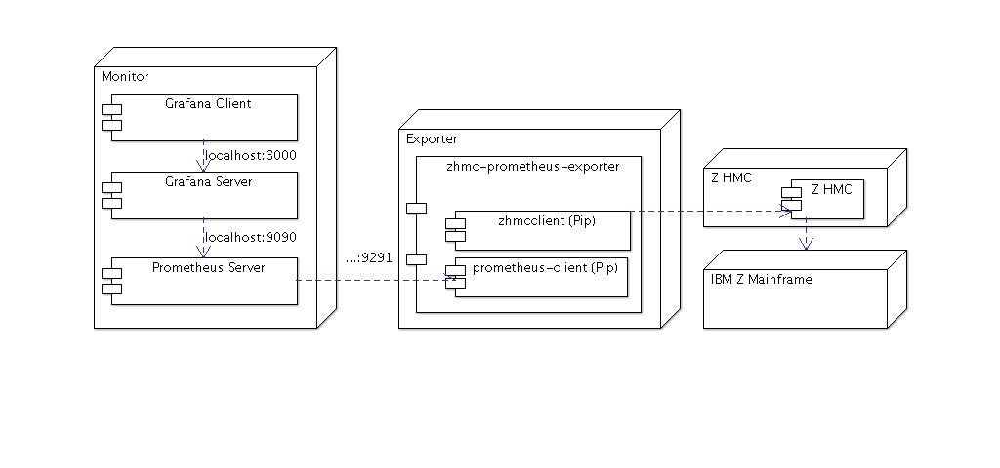

.. Copyright 2018 IBM Corp. All Rights Reserved.
.. 
.. Licensed under the Apache License, Version 2.0 (the "License");
.. you may not use this file except in compliance with the License.
.. You may obtain a copy of the License at
.. 
..    http://www.apache.org/licenses/LICENSE-2.0
.. 
.. Unless required by applicable law or agreed to in writing, software
.. distributed under the License is distributed on an "AS IS" BASIS,
.. WITHOUT WARRANTIES OR CONDITIONS OF ANY KIND, either express or implied.
.. See the License for the specific language governing permissions and
.. limitations under the License.

Introduction
============

What this package provides
--------------------------

``zhmc_prometheus_exporter`` adapts metrics from the `IBM Z`_ Hardware Management Console (HMC) for the `Prometheus`_ monitoring system. It is written in Python and uses the `zhmcclient`_ package.

.. _IBM Z: https://www.ibm.com/it-infrastructure/z
.. _Prometheus: https://prometheus.io
.. _zhmcclient: https://github.com/zhmcclient/python-zhmcclient

Supported environments
----------------------

* Operating systems: It has been tested on Linux. Other operating systems are not officially supported.
* Python versions: It has been tested with versions 3.4 through 3.7. Later versions are not officially supported. Earlier versions, including Python 2, are not supported.
* HMC versions: 2.11.1 and higher

Installation
------------

Due to the language of the exporter and the required dependencies, you are going to need Python & Pip.

Installation with pip
^^^^^^^^^^^^^^^^^^^^^

The traditional way is to install with ``pip``. Run

.. code-block:: bash

  $ pip3 install zhmc-prometheus-exporter

Or, locally run

.. code-block:: bash

  $ pip3 install .

from the cloned repository.

Installation with make
^^^^^^^^^^^^^^^^^^^^^^

If you have ``make`` on your system, the quickest way is to simply run

.. code-block:: bash

  $ make install

from the cloned repository.

Install as little as possible
^^^^^^^^^^^^^^^^^^^^^^^^^^^^^

If you do not want to install the package itself, you can also just run

.. code-block:: bash

  $ pip3 install -r requirements.txt

or, with make:

.. code-block:: bash

  $ make setup

Instead of running ``zhmc_prometheus_exporter``, you will then run ``python3 zhmc_prometheus_exporter/zhmc_prometheus_exporter.py`` from the repository.

Do not install at all: Run as a Docker container
^^^^^^^^^^^^^^^^^^^^^^^^^^^^^^^^^^^^^^^^^^^^^^^^

You will have to configure it before you can run it in Docker container virtualisation. Please refer to :ref:`The exporter in Docker`.

Quickstart
----------

The exporter itself
^^^^^^^^^^^^^^^^^^^

To sign into the HMC, you have to provide credentials in the YAML format. The file ``hmccreds.yaml`` could look something like this (see also the sample in the examples folder):

.. code-block:: yaml

  metrics:
    hmc: 10.10.10.10
    userid: user
    password: password

Furthermore, the file ``metrics.yaml`` defines details about the metrics fetching. An example file is in the repository root, for more information on its anatomy see chapter :ref:`The metrics YAML file`.

Put both of these files into ``/etc/zhmc-prometheus-exporter`` (or link them). You can then run

.. code-block:: bash

  $ zhmc_prometheus_exporter

The default port is 9291, you can change it with ``-p``. If you do not want to put ``hmccreds.yaml`` and ``metrics.yaml`` into ``/etc/zhmc-prometheus-exporter``, you can also specify them with ``-c`` and ``-m`` respectively.

The exporter in Docker
^^^^^^^^^^^^^^^^^^^^^^

Follow the normal quickstart guide, but ensure that your ``hmccreds.yaml`` and ``metrics.yaml`` are in the project home directory. You can then run

.. code-block:: bash

  $ docker build . -t zhmcexporter
  $ docker run -p 9291:9291 zhmcexporter

Demo setup
^^^^^^^^^^

**Beware that using Prometheus and a possible graphical frontend, Grafana, is not the scope of this project. This is a very sparse guide. Consult their documentations if you want anything more complicated than a "three simple metrics" setup.**

* The Prometheus server scrapes the metrics from the exporter. Get it from `the Prometheus download page`_. A sample configuration YAML is provided in the examples folder. Fill in the IP and port the exporter will run on. If you left it at default, the port will be 9291. From the downloaded directory, you can then run::

    $ ./prometheus --config.file=prometheus.yaml

  See also `Prometheus' guide`_.

.. _the Prometheus download page: https://prometheus.io/download/
.. _Prometheus' guide: https://prometheus.io/docs/prometheus/latest/getting_started/

* The Grafana server is a more versatile option to visualise the metrics scraped from metrics. Get it from `Grafana`_. From the downloaded directory, you can then run::

    $ ./bin/grafana-server web

  By default it will be on ``localhost:3000``. You will have to set IP and port of the Prometheus server. If you didn't change it, it's ``localhost:9090``. See also `Prometheus' guide on Grafana`_.

.. _Grafana: https://grafana.com/grafana/download
.. _Prometheus' guide on Grafana: https://prometheus.io/docs/visualization/grafana/

* Create the dashboard in Grafana. A sample JSON is provided in the examples folder. If you want it to work natively, you will have to name your source ``ZHMC_Prometheus``. If you want to change something, you might find it easier to change it in the Web GUI instead of the JSON file.

The following image illustrates what the setup described above could look like.

Reporting issues
----------------

If you encounter a problem, please report it as an `issue on GitHub`_.

.. _issue on GitHub: https://github.com/zhmcclient/zhmc-prometheus-exporter/issues

License
-------

This package is licensed under the `Apache 2.0 License`_.

.. _Apache 2.0 License: http://apache.org/licenses/LICENSE-2.0
