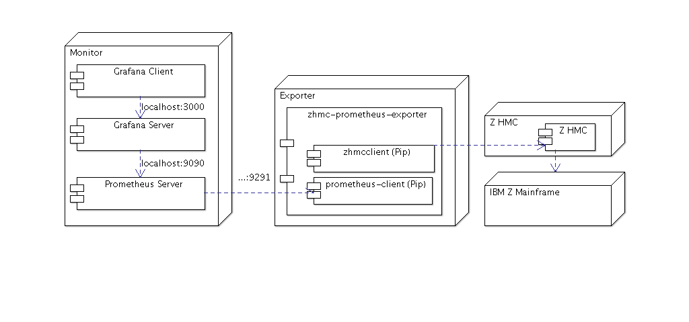

.. Copyright 2018 IBM Corp. All Rights Reserved.
..
.. Licensed under the Apache License, Version 2.0 (the "License");
.. you may not use this file except in compliance with the License.
.. You may obtain a copy of the License at
..
..    http://www.apache.org/licenses/LICENSE-2.0
..
.. Unless required by applicable law or agreed to in writing, software
.. distributed under the License is distributed on an "AS IS" BASIS,
.. WITHOUT WARRANTIES OR CONDITIONS OF ANY KIND, either express or implied.
.. See the License for the specific language governing permissions and
.. limitations under the License.

Usage
=====

This section describes how to use the exporter beyond the quick introduction
in :ref:`Quickstart`.

Running on a system
-------------------

If you want to run the exporter on some system (e.g. on your workstation for
trying it out), it is recommended to use a virtual Python environment.

With the virtual Python environment active, follow the steps in
:ref:`Quickstart` to install, establish the required files, and to run the
exporter.

Running in a Docker container
-----------------------------

If you want to run the exporter in a Docker container you can create the
container as follows, using the Dockerfile provided in the Git repository.

* Clone the Git repository of the exporter and switch to the clone's root
  directory:

  .. code-block:: bash

      $ git clone https://github.com/zhmcclient/zhmc-prometheus-exporter
      $ cd zhmc-prometheus-exporter

* Build a local Docker image as follows:

  .. code-block:: bash

      $ make docker

  This builds a container image named 'zhmc_prometheus_exporter:latest' in your
  local Docker environment.

  The exporter config file is not included in the image, and needs to be
  provided when running the image.

* Run the local Docker image as follows:

  .. code-block:: bash

      $ docker run --rm -v $(pwd)/myconfig:/root/myconfig -p 9291:9291 zhmc_prometheus_exporter -c /root/myconfig/config.yaml -v

  In this command, the exporter config file is provided on the local system
  as ``./myconfig/config.yaml``. The ``-v`` option of 'docker run' mounts the
  ``./myconfig`` directory to ``/root/myconfig`` in the container's file system.
  The ``-c`` option of the exporter references the exporter config file as it
  appears in the container's file system.

zhmc_prometheus_exporter command
--------------------------------

The ``zhmc_prometheus_exporter`` command supports the following arguments:

.. When updating the command help, use a 100 char wide terminal
.. code-block:: text

    usage: zhmc_prometheus_exporter [-h] [-c CONFIG_FILE] [-p PORT] [--log DEST]
                                    [--log-comp COMP[=LEVEL]] [--verbose] [--help-config]

    IBM Z HMC Exporter - a Prometheus exporter for metrics from the IBM Z HMC

    optional arguments:

      -h, --help            show this help message and exit

      -c CONFIG_FILE        path name of exporter config file. Use --help-config for details. Default:
                            /etc/zhmc-prometheus-exporter/config.yaml

      -p PORT               port for exporting. Default: prometheus.port in exporter config file

      --log DEST            enable logging and set a log destination (stderr, syslog, FILE). Default:
                            no logging

      --log-comp COMP[=LEVEL]
                            set a logging level (error, warning, info, debug, off, default: warning)
                            for a component (exporter, hmc, jms, all). May be specified multiple
                            times; options add to the default of: all=warning. Note that using log
                            levels 'info' or 'debug' will produce continuously growing log output.

      --syslog-facility TEXT
                            syslog facility (user, local0, local1, local2, local3, local4, local5,
                            local6, local7) when logging to the system log. Default: user

      --verbose, -v         increase the verbosity level of terminal output during startup of the
                            exporter (max: 2). After the exporter is up and running, no more terminal
                            output will be produced, except in the case of warnings or connection
                            issues.

      --version             show versions of exporter and zhmcclient library and exit

      --upgrade-config      upgrade the exporter config file to the current version of the exporter
                            and exit

      --help-config         show help for exporter config file and exit

Size of log files and terminal output
-------------------------------------

Since the exporter is a long-running process, the size of log files and
of any captured terminal output is important to understand.

The amount of terminal output during startup of the exporter can be controlled
using the ``-v`` / ``--verbose`` option. Once the exporter is up and running,
no more terminal output will be produced (independent of the verbosity level),
except in the case of warnings or connection issues.

When running the exporter in a container, the container tools usually provide
ways to limit the size of the log files with captured terminal output.
For example, Docker provides the ``--log-opt max-size`` and ``--log-opt max-file``
options. Even though the exporter should not produce continuously growing
terminal output, it may still be a good idea to use such options, just to be on
the safe side.

If logging is enabled (with the ``--log`` option of the forwarder), the amount
of log entries can be controlled with the ``--log-comp`` option. Log levels
``info`` and ``debug`` will produce log entries upon each data collection by
Prometheus, and therefore will produce continuously growing log output.

If you experience continuously growing terminal or log output when it should
not be growing according to the above, please open an
`issue <https://github.com/zhmcclient/zhmc-prometheus-exporter/issues>`_
and provide the captured terminal output or the log file that is growing.

Setting up the HMC
------------------

Usage of this package requires that the HMC in question is prepared
accordingly:

* The Web Services API must be enabled on the HMC.

  You can do that in the HMC GUI by selecting "HMC Management" in the left pane,
  then opening the "Configure API Settings" icon on the pain pane,
  then selecting the "Web Services" tab on the page that comes up, and
  finally enabling the Web Services API on that page.

  The above is on a z16 HMC, it may be different on older HMCs.

  If you cannot find this icon, then your userid does not have permission
  for the respective task on the HMC. In that case, there should be some
  other HMC admin you can go to to get the Web Services API enabled.

* The HMC should be configured with a CA-verifiable server certificate because
  since version 0.7.0, the zhmc exporter will reject self-signed certificates
  by default. See :ref:`HMC certificate` for details.

Setting up firewalls or proxies
-------------------------------

If you have to configure firewalls or proxies between the system where you
run the ``zhmc_prometheus_exporter`` command and the HMC, the following ports
need to be opened:

* 6794 (TCP) - for the HMC API HTTP server
* 61612 (TCP) - for the HMC API message broker via JMS over STOMP

For details, see sections "Connecting to the API HTTP server" and
"Connecting to the API message broker" in the :term:`HMC API` book.

HMC userid requirements
-----------------------

This section describes the requirements on the HMC userid that is used by
the ``zhmc_prometheus_exporter`` command.

To return all metrics supported by the command, the HMC userid must have the
following permissions:

* The HMC userid must have the following flag enabled:

  - "Allow access to Web Services management interfaces" flag of the user in
    the HMC GUI, or "allow-management-interfaces" property of the user at the
    WS-API.

* Object access permission to the objects for which metrics should be returned.

  If the userid does not have object access permission to a particular object,
  the exporter will behave as if the object did not exist, i.e. it will
  successfully return metrics for objects with access permission, and ignore
  any others.

  The exporter can return metrics for the following types of objects. To
  return metrics for all existing objects, the userid must have object access
  permission to all of the following objects:

  - CPCs
  - On CPCs in DPM mode:
    - Adapters
    - Partitions
    - NICs
  - On CPCs in classic mode:
    - LPARs

* Task permission for the "Manage Secure Execution Keys" task.

  This is used by the exporter during the 'Get CPC Properties' operation, but
  it does not utilize the CPC properties returned that way (room for future
  optimization).

HMC certificate
---------------

By default, the HMC is configured with a self-signed certificate. That is the
X.509 certificate presented by the HMC as the server certificate during SSL/TLS
handshake at its Web Services API.

Starting with version 0.7, the 'zhmc_prometheus_exporter' command will reject
self-signed certificates by default.

The HMC should be configured to use a CA-verifiable certificate. This can be
done in the HMC task "Certificate Management". See also the :term:`HMC Security`
book and Chapter 3 "Invoking API operations" in the :term:`HMC API` book.

Starting with version 0.7, the 'zhmc_prometheus_exporter' command provides
control knobs for the verification of the HMC certificate via the
``verify_cert`` attribute in the :ref:`exporter config file`, as follows:

* Not specified or specified as ``true`` (default): Verify the HMC certificate
  using the CA certificates from the first of these locations:

  - The certificate file or directory in the ``REQUESTS_CA_BUNDLE`` environment
    variable, if set
  - The certificate file or directory in the ``CURL_CA_BUNDLE`` environment
    variable, if set
  - The `Python 'certifi' package <https://pypi.org/project/certifi/>`_
    (which contains the
    `Mozilla Included CA Certificate List <https://wiki.mozilla.org/CA/Included_Certificates>`_).

* Specified with a string value: An absolute path or a path relative to the
  directory of the exporter config file. Verify the HMC certificate using the CA
  certificates in the specified certificate file or directory.

* Specified as ``false``: Do not verify the HMC certificate.
  Not verifying the HMC certificate means that hostname mismatches, expired
  certificates, revoked certificates, or otherwise invalid certificates will not
  be detected. Since this mode makes the connection vulnerable to
  man-in-the-middle attacks, it is insecure and should not be used in production
  environments.

If a certificate file is specified (using any of the ways listed above), that
file must be in PEM format and must contain all CA certificates that are
supposed to be used. Usually they are in the order from leaf to root, but
that is not a hard requirement. The single certificates are concatenated
in the file.

If a certificate directory is specified (using any of the ways listed above),
it must contain PEM files with all CA certificates that are supposed to be used,
and copies of the PEM files or symbolic links to them in the hashed format
created by the OpenSSL command ``c_rehash``.

An X.509 certificate in PEM format is base64-encoded, begins with the line
``-----BEGIN CERTIFICATE-----``, and ends with the line
``-----END CERTIFICATE-----``.
More information about the PEM format is for example on this
`www.ssl.com page <https://www.ssl.com/guide/pem-der-crt-and-cer-x-509-encodings-and-conversions>`_
or in this `serverfault.com answer <https://serverfault.com/a/9717/330351>`_.

Note that setting the ``REQUESTS_CA_BUNDLE`` or ``CURL_CA_BUNDLE`` environment
variables influences other programs that use these variables, too.

If you do not know which CA certificate the HMC has been configured with,
you can use the following OpenSSL commands to display the certificates
returned by the HMC. Look at the Issuer of the highest certificate in the CA
chain (usually the last one displayed):

.. code-block:: sh

    $ echo | openssl s_client -showcerts -connect $hmc_ip:6794 2>/dev/null | sed -ne '/-BEGIN CERTIFICATE-/,/-END CERTIFICATE-/p' >/tmp/get-server-certs.pem
    $ openssl storeutl -noout -text -certs /tmp/get-server-certs.pem | grep -E "Certificate|Subject:|Issuer"

For more information, see the
`Security <https://python-zhmcclient.readthedocs.io/en/latest/security.html>`_
section in the documentation of the 'zhmcclient' package.

Communication with Prometheus
-----------------------------

The exporter is an HTTP or HTTPS server that is regularly contacted by Prometheus
for collecting metrics using HTTP GET.

The parameters for the communication with Prometheus are defined in the
exporter config file in the ``prometheus`` section, as in the following example:

.. code-block:: yaml

    prometheus:  # optional
      port: 9291
      server_cert_file: server_cert.pem
      server_key_file: server_key.pem
      ca_cert_file: ca_certs.pem

If the ``prometheus`` section is not specified, the exporter starts its
server with HTTP.

If the ``prometheus`` section is specified, the presence of the
``server_cert_file`` parameter will determine whether the server will use HTTP
or HTTPS: If that parameter is specified, HTTPS will be used. If not specified,
HTTP will be used.

If HTTPS is used, the ``server_key_file`` parameter is required.

If HTTPS is used, the presence of the ``ca_cert_file`` parameter determines
whether mutual TLS (mTLS) is enabled: If specified, mTLS is enabled and the
exporter will require Prometheus to present a client certificate, which is
validated using the specified CA certificate chain. If not specified, mTLS is
disabled and the exporter will not require Prometheus to present a client
certificate and will ignore it if presented.

The meaning of the parameters is described in :ref:`exporter config file`.

Exported metric concepts
------------------------

The exporter provides its metrics in the `Prometheus text-based format`_.

All metrics are of the `metric type gauge`_ and follow the
`Prometheus metric naming`_. The names of the metrics are defined in the
:ref:`metric definition file`.

The metric names are structured as follows:

.. code-block:: text

    zhmc_{resource-type}_{metric}_{unit}

Where:

* ``{resource-type}`` is a short lower case term for the type of resource
  the metric applies to, for example ``cpc`` or ``partition``.

* ``{metric}`` is a unique name of the metric within the resource type,
  for example ``processor``.

* ``{unit}`` is the (simple or complex) unit of measurement of the metric
  value. For example, a usage percentage will usually have a unit of
  ``usage_ratio``, while a temperature would have a unit of ``celsius``.

Each metric value applies to a particular instance of a resource. In a
particular set of exported metrics, there are usually metrics for multiple
resource instances. For example, the HMC can manage multiple CPCs, a CPC can
have multiple partitions, and so on. In the exported metrics, the resource
instance is identified using one or more `Prometheus labels`_. Where possible,
the labels identify the resource instances in a hierarchical way from the CPC on
down to the resource to which the metric value applies. For example, a metric
for a partition will have labels ``cpc`` and ``partition`` whose values are the
names of CPC and partition, respectively.

Example for the representation of metric values that are the IFL processor
usage percentages of two partitions in a single CPC:

.. code-block:: text

    # HELP zhmc_partition_ifl_processor_usage_ratio Usage ratio across all IFL processors of the partition
    # TYPE zhmc_partition_ifl_processor_usage_ratio gauge
    zhmc_partition_ifl_processor_usage_ratio{cpc='CPCA',partition='PART1'} 0.42
    zhmc_partition_ifl_processor_usage_ratio{cpc='CPCA',partition='PART2'} 0.07

.. _Prometheus text-based format: https://prometheus.io/docs/instrumenting/exposition_formats/#text-based-format
.. _metric type gauge: https://prometheus.io/docs/concepts/metric_types/#gauge
.. _Prometheus metric naming: https://prometheus.io/docs/practices/naming/
.. _Prometheus labels: https://prometheus.io/docs/concepts/data_model/#metric-names-and-labels

Available metrics
-----------------

The exporter supports two types of metrics. These metrics are differently
retrieved from the HMC, but they are exported to Prometheus in the same way:

* **HMC metric service based** - These metrics are retrieved from the HMC using the
  "Get Metric Context" operation each time Prometheus retrieves metrics from the
  exporter.

* **HMC resource property based** - These metrics are actually the values of
  properties of HMC resources, such as the number of processors assigned
  to a partition. The exporter maintains representations of the corresponding
  resources in memory. These representations are automatically and
  asynchronously updated. When Prometheus retrieves these metrics from the
  exporter, the exporter always has up-to-date resource representations and can
  immediately return them without having to turn around for getting them from
  the HMC.

  There are two mechanisms for retrieving resource properties asynchronously:

  - **via HMC object notifications** - This is used for properties for which
    object notifications are supported. As the set of properties with support
    for object notifications tends to get larger with each HMC generation, the
    metric definition file of the exporter specifies for which properties
    object notifications are not supported (for each environment).

  - **via background property fetching** - For properties for which object
    notifications are not supported, a background thread fetches them from the
    HMC. The background thread sleeps for some time between subsequent property
    fetches. The sleep time is initially 30 seconds, and gets automatically
    adjusted to the cycle time used by Prometheus to fetch the metrics from the
    exporter. The sleep time always stays between 30 and 3600 seconds. As a
    result, it takes at least one extra Prometheus fetch cycle until the changed
    value of such a property appears in the Prometheus data. More than one cycle
    is needed only if the Prometheus cycle is shorter than the fetch time plus
    30 seconds. The timing can be observed in the log at log level info
    (i.e. ``--log-comp all=info``).

  Resources that no longer exist on the HMC are automatically not exported
  anymore. Resources that were created on the HMC since the exporter was
  started are not detected.

The exporter code is agnostic to the actual set of metrics supported by the HMC.
A new metric exposed by the HMC metric service or a new property added to one of
the auto-updated resources can immediately be supported by just adding it to
the :ref:`metric definition file`.

The :ref:`metric definition file` states in its header up to which HMC version
or Z machine generation the metrics are defined.

The following table shows the mapping between exporter metric groups and
exported Prometheus metrics. Note that ensemble and zBX related metrics are not
supported (support for them has been removed in z15). For more details on the
HMC metrics, see section "Metric Groups" in the :term:`HMC API` book.
For more details on the resource properties of CPC and Partition (DPM mode)
and Logical Partition (classic mode), see the corresponding data models
in the :term:`HMC API` book.

====================================  ====  ====  ===========================  ================================
Exporter Metric Group                 Type  Mode  Prometheus Metrics           Prometheus Labels
====================================  ====  ====  ===========================  ================================
cpc-usage-overview                    M     C     zhmc_cpc_*                   cpc
logical-partition-usage               M     C     zhmc_partition_*             cpc, partition
channel-usage                         M     C     zhmc_channel_*               cpc, channel_css_chpid
crypto-usage                          M     C     zhmc_crypto_adapter_*        cpc, adapter_pchid
flash-memory-usage                    M     C     zhmc_flash_memory_adapter_*  cpc, adapter_pchid
roce-usage                            M     C     zhmc_roce_adapter_*          cpc, adapter_pchid
dpm-system-usage-overview             M     D     zhmc_cpc_*                   cpc
partition-usage                       M     D     zhmc_partition_*             cpc, partition
adapter-usage                         M     D     zhmc_adapter_*               cpc, adapter
network-physical-adapter-port         M     D     zhmc_port_*                  cpc, adapter, port
partition-attached-network-interface  M     D     zhmc_nic_*                   cpc, partition, nic
zcpc-environmentals-and-power         M     C+D   zhmc_cpc_*                   cpc
environmental-power-status            M     C+D   zhmc_cpc_*                   cpc
zcpc-processor-usage                  M     C+D   zhmc_processor_*             cpc, processor, type
cpc-resource                          R     C+D   zhmc_cpc_*                   cpc
partition-resource                    R     D     zhmc_partition_*             cpc, partition
logical-partition-resource            R     C     zhmc_partition_*             cpc, partition
storagegroup-resource                 R     D     zhmc_storagegroup_*          cpc, storagegroup
storagevolume-resource                R     D     zhmc_storagevolume_*         cpc, storagegroup, storagevolume
====================================  ====  ====  ===========================  ================================

Legend:

* Type:: The type of the metric group: M=metric service, R=resource property
* Mode: The operational mode of the CPC: C=Classic, D=DPM

As you can see, the ``zhmc_cpc_*`` and ``zhmc_partition_*`` metrics are used
for both DPM mode and classic mode. The names of the metrics are equal if and
only if they have the same meaning in both modes.

The following table shows the Prometheus metrics. This includes both
:term:`metric service based metrics` and :term:`resource property based metrics`:

======================================================  ====  ====  ==================================================================
Prometheus Metric                                       Mode  Type  Description
======================================================  ====  ====  ==================================================================
zhmc_cpc_cp_processor_count                             C+D   G     Number of active CP processors
zhmc_cpc_ifl_processor_count                            C+D   G     Number of active IFL processors
zhmc_cpc_icf_processor_count                            C+D   G     Number of active ICF processors
zhmc_cpc_iip_processor_count                            C+D   G     Number of active zIIP processors
zhmc_cpc_aap_processor_count                            C+D   G     Number of active zAAP processors
zhmc_cpc_cbp_processor_count                            C+D   G     Number of active CBP processors; only for z14-z15
zhmc_cpc_sap_processor_count                            C+D   G     Number of active SAP processors
zhmc_cpc_defective_processor_count                      C+D   G     Number of defective processors of all processor types
zhmc_cpc_spare_processor_count                          C+D   G     Number of spare processors of all processor types
zhmc_cpc_total_memory_mib                               C+D   G     Total amount of installed memory, in MiB
zhmc_cpc_hsa_memory_mib                                 C+D   G     Memory reserved for the base hardware system area (HSA), in MiB
zhmc_cpc_partition_memory_mib                           C+D   G     Memory for use by partitions, in MiB
zhmc_cpc_partition_central_memory_mib                   C+D   G     Memory allocated as central storage across the active partitions, in MiB
zhmc_cpc_partition_expanded_memory_mib                  C+D   G     Memory allocated as expanded storage across the active partitions, in MiB
zhmc_cpc_available_memory_mib                           C+D   G     Memory not allocated to active partitions, in MiB
zhmc_cpc_vfm_increment_gib                              C+D   G     Increment size of VFM, in GiB
zhmc_cpc_total_vfm_gib                                  C+D   G     Total amount of installed VFM, in GiB
zhmc_cpc_processor_usage_ratio                          C+D   G     Usage ratio across all processors of the CPC
zhmc_cpc_shared_processor_usage_ratio                   C+D   G     Usage ratio across all shared processors of the CPC
zhmc_cpc_dedicated_processor_usage_ratio                C     G     Usage ratio across all dedicated processors of the CPC
zhmc_cpc_cp_processor_usage_ratio                       C+D   G     Usage ratio across all CP processors of the CPC
zhmc_cpc_cp_shared_processor_usage_ratio                C+D   G     Usage ratio across all shared CP processors of the CPC
zhmc_cpc_cp_dedicated_processor_usage_ratio             C     G     Usage ratio across all dedicated CP processors of the CPC
zhmc_cpc_ifl_processor_usage_ratio                      C+D   G     Usage ratio across all IFL processors of the CPC
zhmc_cpc_ifl_shared_processor_usage_ratio               C+D   G     Usage ratio across all shared IFL processors of the CPC
zhmc_cpc_ifl_dedicated_processor_usage_ratio            C     G     Usage ratio across all dedicated IFL processors of the CPC
zhmc_cpc_aap_shared_processor_usage_ratio               C     G     Usage ratio across all shared zAAP processors of the CPC
zhmc_cpc_aap_dedicated_processor_usage_ratio            C     G     Usage ratio across all dedicated zAAP processors of the CPC
zhmc_cpc_cbp_processor_usage_ratio                      C     G     Usage ratio across all CBP processors of the CPC; only for z14-z15
zhmc_cpc_cbp_shared_processor_usage_ratio               C     G     Usage ratio across all shared CBP processors of the CPC; only for z14-z15
zhmc_cpc_cbp_dedicated_processor_usage_ratio            C     G     Usage ratio across all dedicated CBP processors of the CPC; only for z14-z15
zhmc_cpc_icf_processor_usage_ratio                      C     G     Usage ratio across all ICF processors of the CPC
zhmc_cpc_icf_shared_processor_usage_ratio               C     G     Usage ratio across all shared ICF processors of the CPC
zhmc_cpc_icf_dedicated_processor_usage_ratio            C     G     Usage ratio across all dedicated ICF processors of the CPC
zhmc_cpc_iip_processor_usage_ratio                      C     G     Usage ratio across all zIIP processors of the CPC
zhmc_cpc_iip_shared_processor_usage_ratio               C     G     Usage ratio across all shared zIIP processors of the CPC
zhmc_cpc_iip_dedicated_processor_usage_ratio            C     G     Usage ratio across all dedicated zIIP processors of the CPC
zhmc_cpc_channel_usage_ratio                            C     G     Usage ratio across all channels of the CPC
zhmc_cpc_accelerator_adapter_usage_ratio                D     G     Usage ratio across all accelerator adapters of the CPC
zhmc_cpc_crypto_adapter_usage_ratio                     D     G     Usage ratio across all crypto adapters of the CPC
zhmc_cpc_network_adapter_usage_ratio                    D     G     Usage ratio across all network adapters of the CPC
zhmc_cpc_storage_adapter_usage_ratio                    D     G     Usage ratio across all storage adapters of the CPC
zhmc_cpc_power_watt                                     C+D   G     Power consumption of the CPC
zhmc_cpc_ambient_temperature_celsius                    C+D   G     Ambient temperature of the CPC
zhmc_cpc_humidity_percent                               C+D   G     Relative humidity
zhmc_cpc_dew_point_celsius                              C+D   G     Dew point
zhmc_cpc_heat_load_total_btu_per_hour                   C+D   G     Total heat load of the CPC
zhmc_cpc_heat_load_forced_air_btu_per_hour              C+D   G     Heat load of the CPC covered by forced-air
zhmc_cpc_heat_load_water_btu_per_hour                   C+D   G     Heat load of the CPC covered by water
zhmc_cpc_exhaust_temperature_celsius                    C+D   G     Exhaust temperature of the CPC
zhmc_cpc_total_partition_power_watt                     C     G     Total power consumption of all partitions; only with SE feature environmental-metrics
zhmc_cpc_total_infrastructure_power_watt                C+D   G     Total power consumption of all infrastructure comp.; only with SE feature environmental-metrics
zhmc_cpc_total_unassigned_power_watt                    C+D   G     Total power consumption of all unassigned comp.; only with SE feature environmental-metrics
zhmc_cpc_power_cord1_phase_a_watt                       C+D   G     Power in Phase A of line cord 1 - 0 if not available
zhmc_cpc_power_cord1_phase_b_watt                       C+D   G     Power in Phase B of line cord 1 - 0 if not available
zhmc_cpc_power_cord1_phase_c_watt                       C+D   G     Power in Phase C of line cord 1 - 0 if not available
zhmc_cpc_power_cord2_phase_a_watt                       C+D   G     Power in Phase A of line cord 2 - 0 if not available
zhmc_cpc_power_cord2_phase_b_watt                       C+D   G     Power in Phase B of line cord 2 - 0 if not available
zhmc_cpc_power_cord2_phase_c_watt                       C+D   G     Power in Phase C of line cord 2 - 0 if not available
zhmc_cpc_power_cord3_phase_a_watt                       C+D   G     Power in Phase A of line cord 3 - 0 if not available
zhmc_cpc_power_cord3_phase_b_watt                       C+D   G     Power in Phase B of line cord 3 - 0 if not available
zhmc_cpc_power_cord3_phase_c_watt                       C+D   G     Power in Phase C of line cord 3 - 0 if not available
zhmc_cpc_power_cord4_phase_a_watt                       C+D   G     Power in Phase A of line cord 4 - 0 if not available
zhmc_cpc_power_cord4_phase_b_watt                       C+D   G     Power in Phase B of line cord 4 - 0 if not available
zhmc_cpc_power_cord4_phase_c_watt                       C+D   G     Power in Phase C of line cord 4 - 0 if not available
zhmc_cpc_power_cord5_phase_a_watt                       C+D   G     Power in Phase A of line cord 5 - 0 if not available
zhmc_cpc_power_cord5_phase_b_watt                       C+D   G     Power in Phase B of line cord 5 - 0 if not available
zhmc_cpc_power_cord5_phase_c_watt                       C+D   G     Power in Phase C of line cord 5 - 0 if not available
zhmc_cpc_power_cord6_phase_a_watt                       C+D   G     Power in Phase A of line cord 6 - 0 if not available
zhmc_cpc_power_cord6_phase_b_watt                       C+D   G     Power in Phase B of line cord 6 - 0 if not available
zhmc_cpc_power_cord6_phase_c_watt                       C+D   G     Power in Phase C of line cord 6 - 0 if not available
zhmc_cpc_power_cord7_phase_a_watt                       C+D   G     Power in Phase A of line cord 7 - 0 if not available
zhmc_cpc_power_cord7_phase_b_watt                       C+D   G     Power in Phase B of line cord 7 - 0 if not available
zhmc_cpc_power_cord7_phase_c_watt                       C+D   G     Power in Phase C of line cord 7 - 0 if not available
zhmc_cpc_power_cord8_phase_a_watt                       C+D   G     Power in Phase A of line cord 8 - 0 if not available
zhmc_cpc_power_cord8_phase_b_watt                       C+D   G     Power in Phase B of line cord 8 - 0 if not available
zhmc_cpc_power_cord8_phase_c_watt                       C+D   G     Power in Phase C of line cord 8 - 0 if not available
zhmc_cpc_status_int                                     C+D   G     Status as integer
zhmc_cpc_has_unacceptable_status                        C+D   G     Boolean indicating whether the CPC has an unacceptable status
zhmc_processor_usage_ratio                              C+D   G     Usage ratio of the processor
zhmc_processor_smt_mode_percent                         C+D   G     Percentage of time the processor was in in SMT mode
zhmc_processor_smt_thread0_usage_ratio                  C+D   G     Usage ratio of thread 0 of the processor when in SMT mode
zhmc_processor_smt_thread1_usage_ratio                  C+D   G     Usage ratio of thread 1 of the processor when in SMT mode
zhmc_partition_description                              C+D   G     Description of the partition (in 'value' label)
zhmc_partition_processor_usage_ratio                    C+D   G     Usage ratio across all processors of the partition
zhmc_partition_cp_processor_usage_ratio                 C     G     Usage ratio across all CP processors of the partition
zhmc_partition_ifl_processor_usage_ratio                C     G     Usage ratio across all IFL processors of the partition
zhmc_partition_icf_processor_usage_ratio                C     G     Usage ratio across all ICF processors of the partition
zhmc_partition_cbp_processor_usage_ratio                C     G     Usage ratio across all CBP processors of the partition; only for z14-z15
zhmc_partition_iip_processor_usage_ratio                C     G     Usage ratio across all IIP processors of the partition
zhmc_partition_accelerator_adapter_usage_ratio          D     G     Usage ratio of all accelerator adapters of the partition
zhmc_partition_crypto_adapter_usage_ratio               D     G     Usage ratio of all crypto adapters of the partition
zhmc_partition_network_adapter_usage_ratio              D     G     Usage ratio of all network adapters of the partition
zhmc_partition_storage_adapter_usage_ratio              D     G     Usage ratio of all storage adapters of the partition
zhmc_partition_zvm_paging_rate_pages_per_second         C     G     z/VM paging rate in pages/sec
zhmc_partition_power_watt                               C     G     Power consumption of the partition; only with SE feature environmental-metrics
zhmc_partition_processor_mode_int                       C+D   G     Allocation mode for processors as an integer (0=shared, 1=dedicated); since HMC 2.15
zhmc_partition_threads_per_processor_ratio              D     G     Number of threads per processor used by OS
zhmc_partition_defined_capacity_msu_per_hour            C     G     Defined capacity expressed in terms of MSU per hour
zhmc_partition_workload_manager_is_enabled              C     G     Boolean indicating whether z/OS WLM is allowed to change processing weight related properties (0=false, 1=true)
zhmc_partition_cp_processor_count                       C+D   G     Number of CP processors allocated to the active partition; since HMC 2.15
zhmc_partition_cp_processor_count_is_capped             C+D   G     Boolean indicating whether absolute capping is enabled for CP processors (0=false, 1=true)
zhmc_partition_cp_processor_count_cap                   C+D   G     Maximum number of CP processors that can be used if absolute capping is enabled, else 0
zhmc_partition_cp_reserved_processor_count              C     G     Number of CP processors reserved for the active partition; since HMC 2.15
zhmc_partition_cp_initial_processing_weight             C+D   G     Initial CP processing weight for the active partition in shared mode
zhmc_partition_cp_minimum_processing_weight             C+D   G     Minimum CP processing weight for the active partition in shared mode
zhmc_partition_cp_maximum_processing_weight             C+D   G     Maximum CP processing weight for the active partition in shared mode
zhmc_partition_cp_current_processing_weight             C+D   G     Current CP processing weight for the active partition in shared mode
zhmc_partition_cp_processor_count_cap                   D     G     Maximum number of CP processors to be used when absolute CP processor capping is enabled
zhmc_partition_cp_initial_processing_weight_is_capped   C+D   G     Boolean indicating whether the initial CP processing weight is capped (0=false, 1=true)
zhmc_partition_cp_current_processing_weight_is_capped   C     G     Boolean indicating whether the current CP processing weight is capped (0=false, 1=true)
zhmc_partition_ifl_processor_count                      C+D   G     Number of IFL processors allocated to the active partition
zhmc_partition_ifl_processor_count_is_capped            C+D   G     Boolean indicating whether absolute capping is enabled for IFL processors (0=false, 1=true)
zhmc_partition_ifl_processor_count_cap                  C+D   G     Maximum number of IFL processors that can be used if absolute capping is enabled, else 0
zhmc_partition_ifl_reserved_processor_count             C     G     Number of IFL processors reserved for the active partition
zhmc_partition_ifl_initial_processing_weight            C+D   G     Initial IFL processing weight for the active partition in shared mode
zhmc_partition_ifl_minimum_processing_weight            C+D   G     Minimum IFL processing weight for the active partition in shared mode
zhmc_partition_ifl_maximum_processing_weight            C+D   G     Maximum IFL processing weight for the active partition in shared mode
zhmc_partition_ifl_current_processing_weight            C+D   G     Current IFL processing weight for the active partition in shared mode
zhmc_partition_ifl_processor_count_cap                  D     G     Maximum number of IFL processors to be used when absolute IFL processor capping is enabled
zhmc_partition_ifl_initial_processing_weight_is_capped  C+D   G     Boolean indicating whether the initial IFL processing weight is capped (0=false, 1=true)
zhmc_partition_ifl_current_processing_weight_is_capped  C     G     Boolean indicating whether the current IFL processing weight is capped (0=false, 1=true)
zhmc_partition_icf_processor_count                      C     G     Number of ICF processors currently allocated to the active partition
zhmc_partition_icf_processor_count_is_capped            C     G     Boolean indicating whether absolute capping is enabled for ICF processors (0=false, 1=true)
zhmc_partition_icf_processor_count_cap                  C     G     Maximum number of ICF processors that can be used if absolute capping is enabled, else 0
zhmc_partition_icf_reserved_processor_count             C     G     Number of ICF processors reserved for the active partition
zhmc_partition_icf_initial_processing_weight            C     G     Initial ICF processing weight for the active partition in shared mode
zhmc_partition_icf_minimum_processing_weight            C     G     Minimum ICF processing weight for the active partition in shared mode
zhmc_partition_icf_maximum_processing_weight            C     G     Maximum ICF processing weight for the active partition in shared mode
zhmc_partition_icf_current_processing_weight            C     G     Current ICF processing weight for the active partition in shared mode
zhmc_partition_icf_initial_processing_weight_is_capped  C     G     Boolean indicating whether the initial ICF processing weight is capped (0=false, 1=true)
zhmc_partition_icf_current_processing_weight_is_capped  C     G     Boolean indicating whether the current ICF processing weight is capped (0=false, 1=true)
zhmc_partition_iip_processor_count                      C     G     Number of zIIP processors currently allocated to the active partition
zhmc_partition_iip_processor_count_is_capped            C     G     Boolean indicating whether absolute capping is enabled for zIIP processors (0=false, 1=true)
zhmc_partition_iip_processor_count_cap                  C     G     Maximum number of zIIP processors that can be used if absolute capping is enabled, else 0
zhmc_partition_iip_reserved_processor_count             C     G     Number of zIIP processors reserved for the active partition
zhmc_partition_iip_initial_processing_weight            C     G     Initial zIIP processing weight for the active partition in shared mode
zhmc_partition_iip_minimum_processing_weight            C     G     Minimum zIIP processing weight for the active partition in shared mode
zhmc_partition_iip_maximum_processing_weight            C     G     Maximum zIIP processing weight for the active partition in shared mode
zhmc_partition_iip_current_processing_weight            C     G     Current zIIP processing weight for the active partition in shared mode
zhmc_partition_iip_initial_processing_weight_is_capped  C     G     Boolean indicating whether the initial zIIP processing weight is capped (0=false, 1=true)
zhmc_partition_iip_current_processing_weight_is_capped  C     G     Boolean indicating whether the current zIIP processing weight is capped (0=false, 1=true)
zhmc_partition_aap_processor_count_is_capped            C     G     Boolean indicating whether absolute capping is enabled for zAAP processors (0=false, 1=true)
zhmc_partition_aap_processor_count_cap                  C     G     Maximum number of zAAP processors that can be used if absolute capping is enabled, else 0
zhmc_partition_aap_initial_processing_weight            C     G     Initial zAAP processing weight for the active partition in shared mode
zhmc_partition_aap_minimum_processing_weight            C     G     Minimum zAAP processing weight for the active partition in shared mode
zhmc_partition_aap_maximum_processing_weight            C     G     Maximum zAAP processing weight for the active partition in shared mode
zhmc_partition_aap_current_processing_weight            C     G     Current zAAP processing weight for the active partition in shared mode
zhmc_partition_aap_initial_processing_weight_is_capped  C     G     Boolean indicating whether the initial zAAP processing weight is capped (0=false, 1=true)
zhmc_partition_aap_current_processing_weight_is_capped  C     G     Boolean indicating whether the current zAAP processing weight is capped (0=false, 1=true)
zhmc_partition_cbp_processor_count_is_capped            C     G     Boolean indicating whether absolute capping is enabled for CBP processors (0=false, 1=true); only for z14-z15
zhmc_partition_cbp_processor_count_cap                  C     G     Maximum number of CBP processors that can be used if absolute capping is enabled, else 0; only for z14-z15
zhmc_partition_cbp_initial_processing_weight            C     G     Initial CBP processing weight for the active partition in shared mode; only for z14-z15
zhmc_partition_cbp_minimum_processing_weight            C     G     Minimum CBP processing weight for the active partition in shared mode; only for z14-z15
zhmc_partition_cbp_maximum_processing_weight            C     G     Maximum CBP processing weight for the active partition in shared mode; only for z14-z15
zhmc_partition_cbp_current_processing_weight            C     G     Current CBP processing weight for the active partition in shared mode; only for z14-z15
zhmc_partition_cbp_initial_processing_weight_is_capped  C     G     Boolean indicating whether the initial CBP processing weight is capped (0=false, 1=true); only for z14-z15
zhmc_partition_cbp_current_processing_weight_is_capped  C     G     Boolean indicating whether the current CBP processing weight is capped (0=false, 1=true); only for z14-z15
zhmc_partition_initial_memory_mib                       D     G     Initial amount of memory allocated to the partition when it becomes active, in MiB
zhmc_partition_reserved_memory_mib                      D     G     Amount of reserved memory (maximum memory minus initial memory), in MiB
zhmc_partition_maximum_memory_mib                       D     G     Maximum amount of memory to which the OS can increase, in MiB
zhmc_partition_initial_central_memory_mib               C     G     Amount of central memory initially allocated to the active partition in MiB, else 0
zhmc_partition_current_central_memory_mib               C     G     Amount of central memory currently allocated to the active partition, in MiB, else 0
zhmc_partition_maximum_central_memory_mib               C     G     Maximum amount of central memory to which the operating system running in the active partition can increase, in MiB
zhmc_partition_initial_expanded_memory_mib              C     G     Amount of expanded memory initially allocated to the active partition in MiB, else 0
zhmc_partition_current_expanded_memory_mib              C     G     Amount of expanded memory currently allocated to the active partition, in MiB, else 0
zhmc_partition_maximum_expanded_memory_mib              C     G     Maximum amount of expanded memory to which the operating system running in the active partition can increase, in MiB
zhmc_partition_initial_vfm_memory_gib                   C     G     Initial amount of VFM memory to be allocated at partition activation, in GiB
zhmc_partition_maximum_vfm_memory_gib                   C     G     Maximum amount of VFM memory that can be allocated to the active partition, in GiB
zhmc_partition_current_vfm_memory_gib                   C     G     Current amount of VFM memory that is allocated to the active partition, in GiB
zhmc_partition_status_int                               D     G     Partition status as integer (0=active, 1=degraded, 10=paused, 11=stopped, 12=starting, 13=stopping, 20=reservation-error, 21=terminated, 22=communications-not-active, 23=status-check, 99=unsupported value)
zhmc_partition_lpar_status_int                          C     G     LPAR status as integer (0=operating, 1=not-operating, 2=not-activated, 10=exceptions, 99=unsupported value)
zhmc_partition_has_unacceptable_status                  C+D   G     Boolean indicating whether the partition has an unacceptable status
zhmc_partition_storage_group_uris                       D     G     URIs of storage groups attached to the partition, as a comma-separated list; since HMC 2.15
zhmc_partition_storage_groups                           D     G     Storage groups attached to the partition, as a comma-separated list; since HMC 2.15
zhmc_storagegroup_type_int                              D     G     Storage group type as integer (0=fcp, 1=fc, 2=nvme, 99=unsupported value)
zhmc_storagegroup_fulfillment_state_int                 D     G     Storage group fulfillment state as integer (0=complete, 1=pending, 2=pending-with-mismatches, 3=checking-migration, 4=incomplete, 99=unsupported value)
zhmc_storagegroup_shared                                D     G     Boolean indicating whether the storage group is shared (0=false, 1=true)
zhmc_storagegroup_max_partitions                        D     G     Maximum number of partitions a storage group can be attached to; only for FCP-type SGs
zhmc_storagevolume_fulfillment_state_int                D     G     Storage volume fulfillment state as integer (0=complete, 1=configuration-error, 2=deleting, 3=incomplete, 4=overprovisioned, 5=pending, 6=pending-with-mismatches, 99=unsupported value)
zhmc_storagevolume_usage_int                            D     G     Usage of volume as integer (0=boot, 1=data, 2=not-applicable, 99=unsupported value)
zhmc_storagevolume_size_gib                             D     G     Size of volume in GiB (0 for ECKD alias volumes)
zhmc_storagevolume_cylinders                            D     G     Size of ECKD volume in cylinders (0 for ECKD alias volumes); only for FC-type SGs
zhmc_crypto_adapter_usage_ratio                         C     G     Usage ratio of the crypto adapter
zhmc_flash_memory_adapter_usage_ratio                   C     G     Usage ratio of the flash memory adapter
zhmc_adapter_usage_ratio                                D     G     Usage ratio of the adapter
zhmc_channel_usage_ratio                                C     G     Usage ratio of the channel
zhmc_roce_adapter_usage_ratio                           C     G     Usage ratio of the RoCE adapter
zhmc_port_bytes_sent_count                              D     C     Number of Bytes in unicast packets that were sent
zhmc_port_bytes_received_count                          D     C     Number of Bytes in unicast packets that were received
zhmc_port_packets_sent_count                            D     C     Number of unicast packets that were sent
zhmc_port_packets_received_count                        D     C     Number of unicast packets that were received
zhmc_port_packets_sent_dropped_count                    D     C     Number of sent packets that were dropped (resource shortage)
zhmc_port_packets_received_dropped_count                D     C     Number of received packets that were dropped (resource shortage)
zhmc_port_packets_sent_discarded_count                  D     C     Number of sent packets that were discarded (malformed)
zhmc_port_packets_received_discarded_count              D     C     Number of received packets that were discarded (malformed)
zhmc_port_multicast_packets_sent_count                  D     C     Number of multicast packets sent
zhmc_port_multicast_packets_received_count              D     C     Number of multicast packets received
zhmc_port_broadcast_packets_sent_count                  D     C     Number of broadcast packets sent
zhmc_port_broadcast_packets_received_count              D     C     Number of broadcast packets received
zhmc_port_data_sent_bytes                               D     G     Amount of data sent over the collection interval
zhmc_port_data_received_bytes                           D     G     Amount of data received over the collection interval
zhmc_port_data_rate_sent_bytes_per_second               D     G     Data rate sent over the collection interval
zhmc_port_data_rate_received_bytes_per_second           D     G     Data rate received over the collection interval
zhmc_port_bandwidth_usage_ratio                         D     G     Bandwidth usage ratio of the port
zhmc_nic_bytes_sent_count                               D     C     Number of Bytes in unicast packets that were sent
zhmc_nic_bytes_received_count                           D     C     Number of Bytes in unicast packets that were received
zhmc_nic_packets_sent_count                             D     C     Number of unicast packets that were sent
zhmc_nic_packets_received_count                         D     C     Number of unicast packets that were received
zhmc_nic_packets_sent_dropped_count                     D     C     Number of sent packets that were dropped (resource shortage)
zhmc_nic_packets_received_dropped_count                 D     C     Number of received packets that were dropped (resource shortage)
zhmc_nic_packets_sent_discarded_count                   D     C     Number of sent packets that were discarded (malformed)
zhmc_nic_packets_received_discarded_count               D     C     Number of received packets that were discarded (malformed)
zhmc_nic_multicast_packets_sent_count                   D     C     Number of multicast packets sent
zhmc_nic_multicast_packets_received_count               D     C     Number of multicast packets received
zhmc_nic_broadcast_packets_sent_count                   D     C     Number of broadcast packets sent
zhmc_nic_broadcast_packets_received_count               D     C     Number of broadcast packets received
zhmc_nic_data_sent_bytes                                D     G     Amount of data sent over the collection interval
zhmc_nic_data_received_bytes                            D     G     Amount of data received over the collection interval
zhmc_nic_data_rate_sent_bytes_per_second                D     G     Data rate sent over the collection interval
zhmc_nic_data_rate_received_bytes_per_second            D     G     Data rate received over the collection interval
======================================================  ====  ====  ==================================================================

Legend:

* Mode: The operational mode of the CPC: C=Classic, D=DPM
* Type: The Prometheus metric type: G=Gauge, C=Counter

Labels on exported metrics
--------------------------

The metrics exported to Prometheus are tagged with labels defined in the
exporter config file (at the global level) or in the metric definition file
(at the level of HMC metric groups and HMC metrics).

This section describes what kinds of labels can be defined in these files.

Labels at the global level (defined in the exporter config file):

.. code-block:: yaml

    extra_labels:
      - name: {label-name}
        value: {label-value}

Where:

* ``{label-name}`` - Name of the label.
* ``{label-value}`` - A :term:`Jinja2 expression` that is evaluated and used as
  the value of the label.

  The following variables are available for use in that Jinja2 expression:

  - ``hmc_info`` - Dictionary with the result of the "Query API Version"
    HMC operation. For details, see the description of that operation in the
    :term:`HMC API` book. Some notable dictionary items are:

    - ``hmc-name`` - Name of the HMC.
    - ``hmc-version`` - Version of the HMC as a string (e.g. "2.16").

Example (fragments from an exporter config file):

.. code-block:: yaml

    extra_labels:
      - name: hmc
        value: "hmc_info['hmc-name']"        # HMC name obtained from HMC
      - name: dc
        value: "'dal13'"                     # Literal value 'dal13'

Labels at the HMC metric and HMC metric group level (defined in the metric
definition file). This information is just for reference - the metric
definition file is included in the exporter Python package and should not be
changed by users:

.. code-block:: yaml

    labels:
      - name: {label-name}
        value: {label-value}

Where:

* ``{label-name}`` - Name of the label.

* ``{label-value}`` - A :term:`Jinja2 expression` that is evaluated and used as
  the value of the label.

  The following variables are available for use in that Jinja2 expression:

  - ``resource_obj`` - The resource to which the metric applies, as a
    :class:`zhmcclient.BaseResource` object. This can be used for example to
    get the name of the resource or its parent or grand-parent resources,
    or to get other properties of the resource.

  - ``metric_values`` - Dictionary of all metric values in the same metric group,
    for the resource to which the metric applies. Key is the HMC metric name.
    This variable is only present for :term:`metric service based metrics`, but
    not for :term:`resource property based metrics`.
    This can be used for example to get metrics that carry information such as
    channel name or line cord name.

Example (fragments from a metric definition file):

.. code-block:: yaml

    metric_groups:

      channel-usage:
        # . . .
        labels:
          - name: cpc
            value: "resource_obj.name"                          # CPC name
          - name: channel_css_chpid
            value: "metric_values['channel-name']"              # Value of 'channel-name' metric

      logical-partition-usage:
        # . . .
        labels:
          - name: cpc
            value: "resource_obj.manager.parent.name"           # Name of CPC with the partition
          - name: partition
            value: "resource_obj.name"                          # Partition name

    metrics:

      logical-partition-resource:

        - property_name: workload-manager-enabled
          exporter_name: workload_manager_is_enabled
          exporter_desc: Boolean indicating whether WLM is allowed to ...
          labels:
            - name: valuetype
              value: "'bool'"                                   # Literal value 'bool'

        - properties_expression: "{'operating': 0, 'not-operating': 1, ..."
          exporter_name: lpar_status_int
          exporter_desc: "LPAR status as integer (0=operating, 1=not-operating, ..."
          labels:
            - name: value
              value: "resource_obj.properties['status']"        # Value of 'status' property (as string)

Exporter config file
--------------------

The *exporter config file* tells the exporter which HMC to talk to for
obtaining metrics, and which userid and password to use for logging on to
the HMC.

It also specifies how Prometheus should communicate with the exporter.

In addition, it allows specifying additional labels to be used in all
metrics exported to Prometheus. This can be used for defining labels that
identify the environment managed by the HMC, in cases where metrics from
multiple instances of exporters and HMCs come together.

Finally, it specifies which metric groups to export.

The exporter config file is in YAML format and has the following structure:

.. code-block:: yaml

    version: 2

    hmcs:
      - host: {hmc-ip-address}
        userid: {hmc-userid}
        password: {hmc-password}
        verify_cert: {hmc-verify-cert}

    prometheus:  # optional
      port: {prom-port}
      server_cert_file: {prom-server-cert-file}
      server_key_file: {prom-server-key-file}
      ca_cert_file: {prom-ca-cert-file}

    extra_labels:  # optional
      # list of labels:
      - name: {extra-label-name}
        value: {extra-label-value}

    metric_groups:
      # Dict of HMC and resource metric groups
      {hmc-metric-group}:
        export: {export-bool}

Where:

* ``{hmc-ip-address}`` is the IP address of the HMC.

* ``{hmc-userid}`` is the userid on the HMC to be used for logging on.

* ``{hmc-password}`` is the password of that userid.

* ``{hmc-verify-cert}`` controls whether and how the HMC server certificate is
  verified. For details, see :ref:`HMC certificate`.

* ``{prom-port}`` is the port for exporting. Default: 9291.

* ``{prom-server-cert-file}`` is the path name of a certificate file in PEM
  format containing an X.509 server certificate that will be presented to
  Prometheus during TLS handshake. Relative path names are relative to the
  directory of the exporter config file. If the ``server_cert_file`` parameter
  is specified, the exporter will start its server with HTTPS, and otherwise
  with HTTP.

* ``{prom-server-key-file}`` is the path name of a key file in PEM format
  containing an X.509 private key that belongs to the public key in the server
  certificate. Relative path names are relative to the directory of the
  exporter config file. The ``server_key_file`` parameter is required when
  the ``server_cert_file`` parameter is specified.

* ``{prom-ca-cert-file}`` is the path name of a CA file in PEM format
  containing X.509 CA certificates that will be used for validating a client
  certificate presented by Prometheus during TLS handshake. Relative path names
  are relative to the directory of the exporter config file. If the
  ``ca_cert_file`` parameter is specified, the exporter will require from
  Prometheus to present a client certificate during TLS handshake and will
  validate it using the specified CA certificate chain (mutual TLS, mTLS).
  If not specified, the exporter will not require from Prometheus to present a
  client certificate, and will ignore it if presented.

* ``{extra-label-name}`` is the label name.

* ``{extra-label-value}`` is the label value. The string value is used directly
  without any further interpretation.

* ``{hmc-metric-group}`` is the name of the metric group on the HMC or the
  resource metric group.

* ``{export-bool}`` is a boolean indicating whether the user wants this metric
  group to be exported to Prometheus. For the metric group to actually be
  exported, the ``if`` property in the corresponding metric group in the
  metric definition file, if specified, also needs to evaluate to True.

Migration of exporter config file to version 2 format
-----------------------------------------------------

The exporter versions 1.x supported the version 1 format for the exporter config
file and referred to it as the "HMC credentials file". If you have been using
an exporter version 1.x, you should migrate your "HMC credentials file" to
the version 2 format. The version 1 format is still supported but it is
internally upgraded to the current version when using the exporter, without
persisting the changes to the file.

The '--upgrade-config'  command line option can be used to upgrade the
exporter config file to the current version. When doing that, YAML comments
are preserved, except when they are preceding or following any items that are
removed as part of the upgrade (e.g. the 'metrics' item in a version 1 file).

Sample exporter config file
---------------------------

The following is a sample exporter config file (``config.yaml``).

The file can be downloaded from the Git repo as
`examples/config.yaml <https://github.com/zhmcclient/zhmc-prometheus-exporter/blob/master/examples/config.yaml>`_.

.. literalinclude:: ../examples/config.yaml
  :language: yaml

Metric definition file
----------------------

The *metric definition file* maps the metrics returned by the HMC to metrics
exported to Prometheus.

Starting with exporter version 2.0, the metric definition file is included in
the Python package and no longer needs to be downloaded or edited by users.
The control flags for exporting metric groups are now in the exporter config
file.

For reference, the format of the metric definition file is described
in :ref:`Format of metric definition file`.

Sample output to Prometheus
---------------------------

The following is sample output of the exporter to Prometheus. It is from a z14
system in DPM mode and was created with an extra label ``pod=wdc04-05``, and
with all metric groups enabled. The data has been reduced to show only three
example partitions (but all adapters and processors):

.. literalinclude:: ../examples/prometheus.out
  :language: text

Demo setup with Grafana
-----------------------

This section describes a demo setup with a Prometheus server and with the Grafana
frontend for visualizing the metrics.

The Prometheus server scrapes the metrics from the exporter. The Grafana server
provides a HTML based web server that visualises the metrics in a dashboard.

The following diagram shows the demo setup:

Perform these steps for setting it up:

* Download and install Prometheus from the `Prometheus download page`_ or
  using your OS-specific package manager.

  Copy the sample Prometheus configuration file (``examples/prometheus.yaml`` in
  the Git repo) as ``prometheus.yaml`` into some directory where you will run
  the Prometheus server. The host:port for contacting the exporter is already
  set to ``localhost:9291`` and it can be changed as needed.

  Run the Prometheus server as follows:

  .. code-block:: bash

      $ prometheus --config.file=prometheus.yaml

  For details, see the `Prometheus guide`_.

.. _Prometheus download page: https://prometheus.io/download/
.. _Prometheus guide: https://prometheus.io/docs/prometheus/latest/getting_started/

* Download and install Grafana from the `Grafana download page`_ or
  using your OS-specific package manager.

  Run the Grafana server as follows:

  .. code-block:: bash

      $ grafana-server -homepath {homepath} web

  Where:

  * ``{homepath}`` is the path name of the directory with the ``conf`` and
    ``data`` directories, for example
    ``/usr/local/Cellar/grafana/7.3.4/share/grafana`` on macOS when Grafana
    was installed using Homebrew.

  By default, the web interface will be on ``localhost:3000``. This can be
  changed as needed. For details, see the `Prometheus guide on Grafana`_.

.. _Grafana download page: https://grafana.com/grafana/download
.. _Prometheus guide on Grafana: https://prometheus.io/docs/visualization/grafana/

* Direct your web browser at http://localhost:3000 and log on using admin/admin.

  Create a data source in Grafana with:

  * Name: ``ZHMC_Prometheus``
  * URL: http://localhost:9090

  Create a dashboard in Grafana by importing the sample dashboard
  (``examples/grafana.json`` in the Git repo). It will use the data source
  ``ZHMC_Prometheus``.

Logging
-------

The exporter supports logging its own activities and the interactions with the
HMC. By default, logging is disabled.

Logging is enabled by using the ``--log DEST`` option that controls the
logging destination as follows:

* ``--log stderr`` - log to the Standard Error stream
* ``--log syslog`` - log to the System Log (see :ref:`Logging to the System Log`)
* ``--log FILE`` - log to the log file with path name ``FILE``.

There are multiple components that can log. By default, all of them log at the
warning level. This can be fine tuned by using the ``--log-comp COMP[=LEVEL]``
option. This option can be specified multiple times, and the specified options
add in sequence to the default of ``all=warning``.

The components that can be specified in ``COMP`` are:

* ``exporter`` - activities of the exporter.
  Logger name: ``zhmcexporter``.
* ``hmc`` - HTTP interactions with the HMC performed by the zhmcclient library.
  Logger name: ``zhmcclient.hmc``.
* ``jms`` - JMS notifications from the HMC received by the zhmcclient library.
  Logger name: ``zhmcclient.jms``.
* ``all`` - all of these components.

The log levels that can be specified in ``LEVEL`` are:

* ``error`` - Show only errors for the component. Errors are serious conditions
  that need to be fixed by the user. Some errors may need to be reported as
  issues. The exporter retries with the HMC in case of certain errors, but some
  errors cause the exporter to terminate.
* ``warning`` - Show errors and warnings for the component. Warnings never cause
  the exporter to terminate, but should be analyzed and may need to be fixed.
* ``info`` - Show informations, warnings and errors for the component.
  Informations are useful to understand what is going on.
* ``debug`` - Show debug info, informations, warnings and errors for the
  component. Debug info provides a very detailed amount of information that may
  be useful foo analyzing problems.
* ``off`` - Show no log messages for the component.

The ``LEVEL`` part can be omitted in the ``--log-comp`` option, and its
default is ``warning``. This is for compatibility with older versions of the
exporter.

The default log level for each component is ``warning``, and specifying
other log levels changes that level only for the specified components but
keeps the default for those components that are not specified.

Examples:

.. code-block:: bash

    # log to Standard Error with all=warning
    $ zhmc_prometheus_exporter --log stderr ...

    # log to file mylog.log with all=warning
    $ zhmc_prometheus_exporter --log mylog.log ...

    # log to file mylog.log with exporter=info, hmc=warning (by default), jms=warning (by default)
    $ zhmc_prometheus_exporter --log mylog.log --log-comp exporter=info

    # log to file mylog.log with exporter=info, hmc=warning (by default), jms=debug
    $ zhmc_prometheus_exporter --log mylog.log --log-comp exporter=info --log-comp jms=debug

    # log to file mylog.log with exporter=debug, hmc=debug, jms=debug
    $ zhmc_prometheus_exporter --log mylog.log --log-comp all=debug

    # log to file mylog.log with exporter=info, hmc=off, jms=off
    $ zhmc_prometheus_exporter --log mylog.log --log-comp all=off --log-comp exporter=info

Logging to the System Log
^^^^^^^^^^^^^^^^^^^^^^^^^

When logging to the System Log, the syslog address used by the exporter
depends on the operating system as follows:

* Linux: ``/dev/log``
* macOS: ``/var/run/syslog``
* Windows: UDP port 514 on localhost (requires a syslog demon to run)
* CygWin: ``/dev/log`` (requires the syslog-ng package to be installed)

For other operating systems, UDP port 514 on localhost is used.

Messages logged to the system log will only show up there if the syslog
configuration has enabled the syslog facility and the syslog severity levels
that are used by the exporter.
The configuration of the syslog depends on the operating system or syslog demon
that is used and is therefore not described here.

The syslog facility that will be used by the exporter can be specified with the
``--syslog-facility`` option and defaults to ``user``.

The syslog severity levels (not to be confused with syslog priorities) that will
be used by the exporter are derived from the Python log levels using the default
mapping defined by Python logging, which is:

================  =================
Python log level  Syslog severity
================  =================
``ERROR``         3 (Error)
``WARNING``       4 (Warning)
``INFO``          6 (Informational)
``DEBUG``         7 (Debug)
================  =================

On some systems, the syslog rejects messages that exceed a certain limit.
For this reason, the exporter truncates the message text to somewhat below
2048 Bytes, when logging to the system log. Messages are not truncated when
logging to the Standard Error stream or to a file.

Performance
-----------

The support for :term:`resource property based metrics` that was introduced in
version 1.0 has slowed down the startup of the exporter quite significantly if
these metrics are enabled.

Here is an elapsed time measurement for the startup of the exporter using an HMC
in one of our development data centers:

* 11:33 min for preparing auto-update for 143 partitions on two z14 systems in classic mode
* 0:12 min for preparing auto-update for 98 partitions on two z13 systems in DPM mode
* 1:30 min for preparing auto-update for the 4 CPCs
* 10:25 min for all other startup activities (without the
  partition-attached-network-interface metrics group that would have been 0:48 min)

Once the exporter is up and running, the fetching of metrics by Prometheus from
the exporter is very fast:

* 0:00.35 min (=350 ms) for fetching metrics with 236 HELP/TYPE lines and 5269
  metric value lines (size: 500 KB)

In this measurement, the complete set of metrics was enabled for the 4 CPCs
described above.

This result includes metric values from properties of auto-updated resources
(which are maintained in the exporter and are updated asynchronously via
notifications the exporter receives from the HMC) and metric values retrieved
from the HMC metric service by executing a single HMC operation
("Get Metric Context").

This was measured with a local web browser that was directed to an exporter
running on the same local system (a MacBook Pro). The network path between the
exporter and the targeted HMC went via VPN to the IBM Intranet (via WLAN and
Internet) and then across a boundary firewall.
